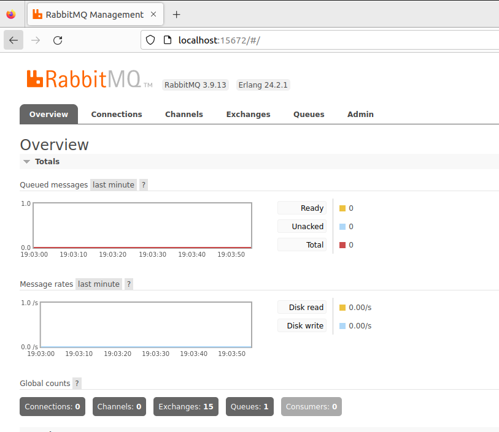
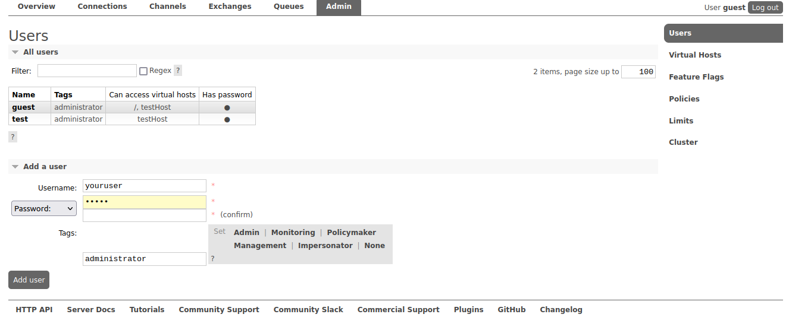
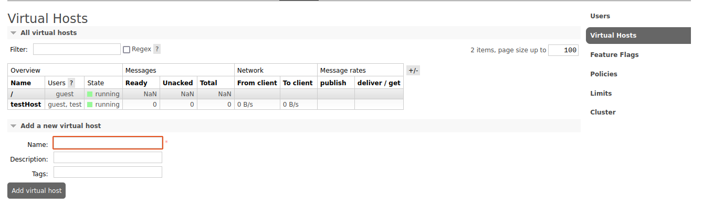
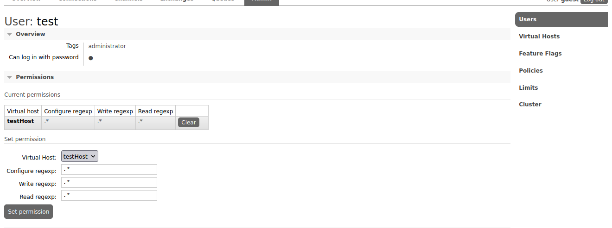
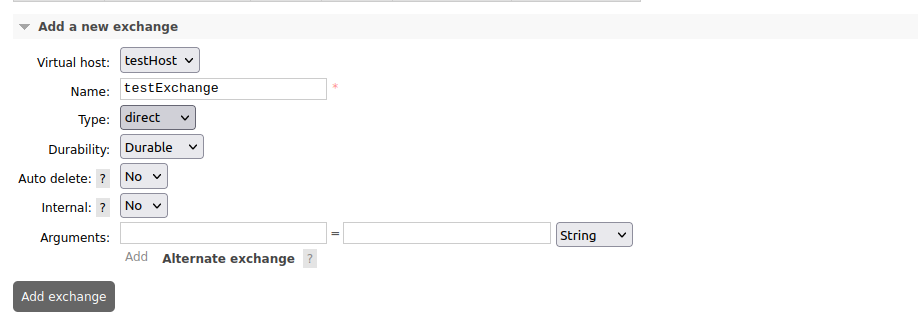
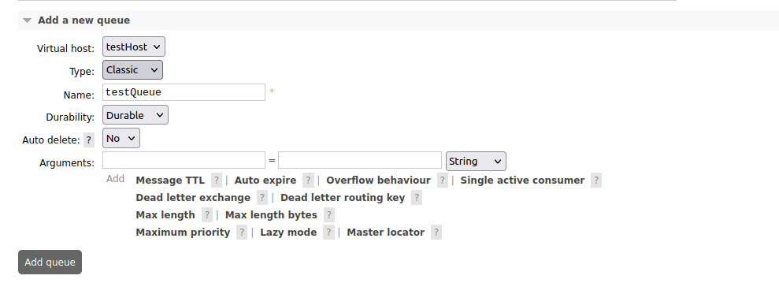

# Getting Started with RabbitMQ

We were provided the seed code by Professor Kehoe.


## First steps
Based on what we have here, we can see quite a few different files. 

While not all of them are useful, we can see how a few of them are used.

Before getting started, we'll need to make sure that our Ubuntu machines are up to date with the latest packages and with all necessary libraries ready.

Think of the following as a quick requirements.txt, but for Ubuntu. You'll want to run each command separately. We might create a shell script that automates this, but for now, run each line by line:

```shell
# Check for updates
sudo apt update
# Install the updates 
sudo apt upgrade 

# Install vim so that we can edit files better
sudo apt install vim

# Install php
sudo apt install php

# install AMQP
sudo apt install php-amqp

# Install RabbitMQ-Server
sudo apt install rabbitmq-server

# Check for updates again because why note

sudo apt update
sudo apt upgrade
```

Okay, cool - with this all set, we'll try to run the code that we have.

## Try to run the code

We'll first start by trying to run the server

```shell
./testRabbitMQServer.php
```

You'll get an error message - Authentication is failing. Checking the /var/log/rabbitmq logs, you'll find that there are a number of reasons to fail. The first one causes everything to fail, and more won't even show until you resolve them. But I'll save you the time and explain exactly what's happening:

### Nothing is set up

Wild, right? Not necessarily true, but if you examine [testRabbitMQ.ini](../testRabbitMQ.ini), you'll see that the username and password are both set to test. But the default is actually guest. Now you can go about this two ways: you can simply change the ini file to reflect guest, OR you can do it the right way.

The right way to do this is to create a new user, password, and enabled the VHOST, Exchange, and Queues necessary. As we attempt to start the server php file, we were getting denied because the users did not exist. Let's make them real. We can (and probably will) do this from the CLI in the future, but for now, we'll do it from the web interface.

## Managing RabbitMQ

You'll need to enable the gui. To do this, you'll need to run the following command:

```shell
sudo rabbitmq-plugins enable rabbitmq_management
```
This enables the management gui.

We can log in by going to localhost:15672 and logging in with the default credentials of guest:guest.

From here, there is work to be done.

This is what it will look like:


Start by clicking on the Admin tab. You can either start by adding a Virtual Host or the user, I chose the user. 

Let's create a new user. We'll call it test, and give it a password of test. We'll also give it the tag of administrator. This will allow us to do everything we need to do from the web interface.



Now that we have a user, we'll need to create a virtual host. We'll call it testHost. Note, that we are only calling our information test or testHost or test whatever because that is what is in the ini file. You can and should choose more secure information.




Great, only a few more things to go through. Before adding our exchange or queue, we should update our user. Click back to users, click on the user, and give them the permission to do everything on the testHost.




Alright - with the user updated and the virtual host complete, we can now add our exchange and queue.

Click on Exchanges. Scroll down, click the drop down for Add a new exchange, and select Virtual host. Select the testHost. Give it the same name as the one in the ini file, which in our case, is testExchange. Select the type as direct. Click Add exchange. I didn't add any arguments. I don't know what they do just yet, to be honest.



Now add your queue. Click on Queues, click the toggle to add a new queue, select the virtual host as testHost (or whatever the host is), name it, and add it.



Now we are ready to rock and roll. We set up the  user, the virtual host, the exchange, and the queue. We can now run the server.

```shell
./testRabbitMQServer.php

```
Which will return:
```
testRabbitMQServer BEGIN
```

Beautiful. The server is now up. 


-------- More coming soon --------